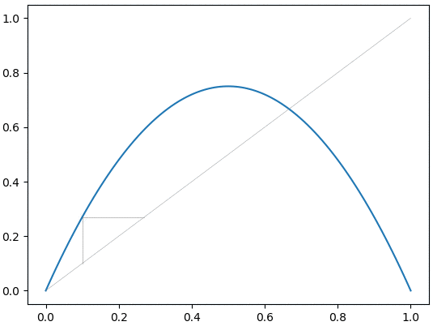
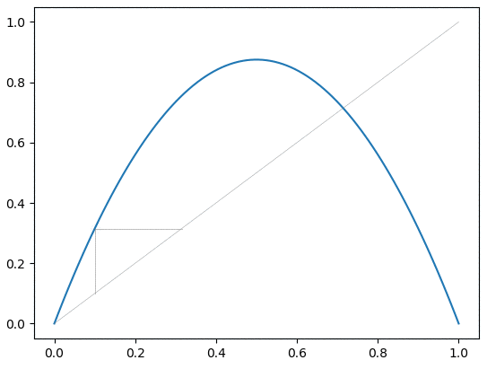
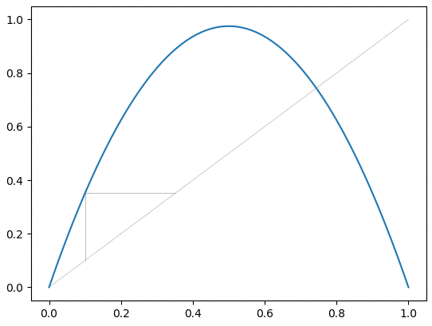
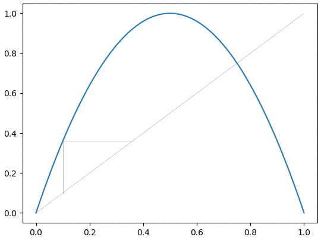
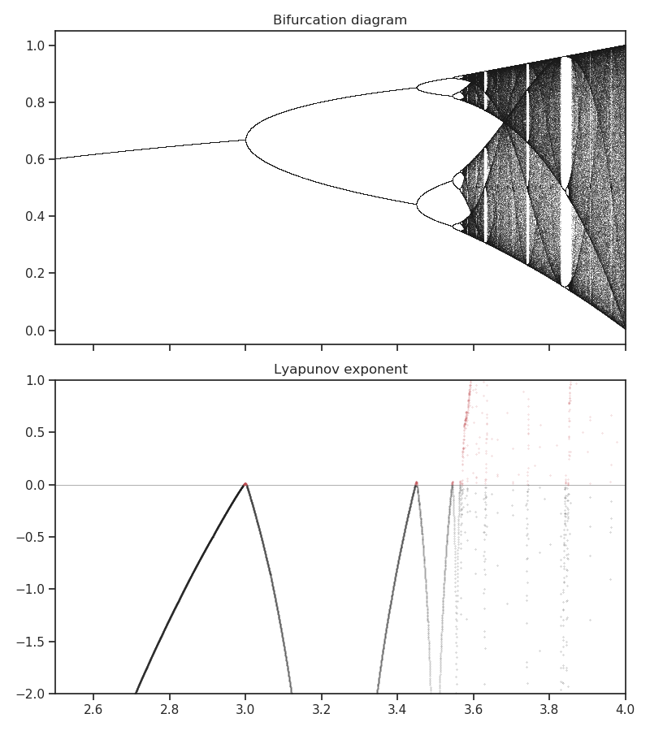
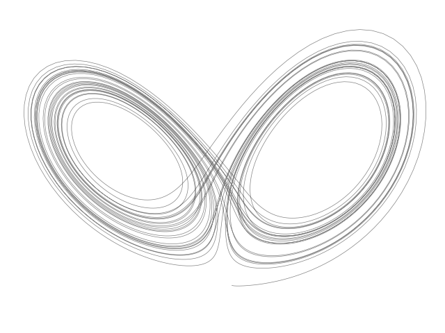

# Some code to mess around with chaotic systems!

Poincare map with R=3.0:

Poincare map with R=3.5:

Poincare map with R=3.9:

Poincare map with R=4.0:

Bifurcation diagram for logistic map (r vs x):

3D convective Lorenz attractor:

